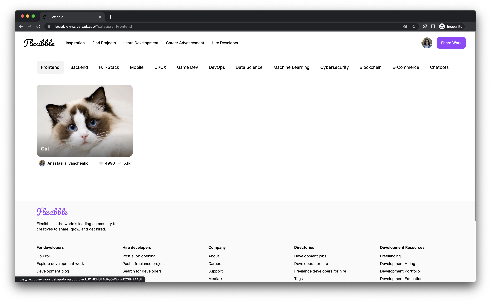

# Flexibble

Live Site URL: [Flexibble](https://flexibble-iva.vercel.app)

## Table of contents

- [About the project](#about-the-project)
  - [Links](#links)
  - [Built with](#built-with)
- [Getting started](#getting-started)
  - [Installation](#installation)
- [Acknowledgments](#acknowledgments)

## About the project



Users are be able to:

- Filter projects
- Create new projects
- Edit their own projects
- View the optimal layout for the interface depending on their device's screen size
- See hover and focus states for all interactive elements on the page

### Links

Live Site URL: [Flexibble](https://flexibble-iva.vercel.app)

### Built with

- TypeScript
- React
- Next.js
- Tailwind CSS

## Getting Started

1. Clone the repo:

   ```bash
   git clone https://github.com/iva-stasia/flexibble.git
   ```

2. Install NPM packages:

   ```bash
   npm install
   ```

3. Run the development server:

   ```bash
   npm run dev
   ```

## Acknowledgments

The application was created based on a [tutorial](https://www.youtube.com/watch?v=986hztrfaSQ) by [JavaScript Mastery](https://www.youtube.com/@javascriptmastery).
